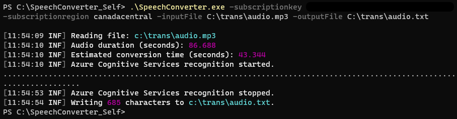

# SpeechConverter

## Overview

SpeechConverter is a .NET Core 3.1 console application which leverages the Azure Cognitive Services Speech service to perform speech-to-text conversion of MP3 files.

### Features

1. Performs speech-to-text conversion of MP3 file to .txt file.
2. Detects duration of MP3 file, predicts conversion time, and displays both in console.
3. Displays progress of events (Recognizing) from Azure Cognitive Services.
4. Displays characters written to output file.
5. Detects issues with required parameters and displays help screen.
6. Prevents same input/output file names.

## Pre-Requisites

- .NET Core 3.1 SDK (to build the project)
- GStreamer 1.14.5

### GStreamer

This project requires the installation of GStreamer version [1.14.5](https://gstreamer.freedesktop.org/data/pkg/windows/1.14.5/gstreamer-1.0-x86-1.14.5.msi) and the definition of a system environment variable pointing to the location of the application's binary files.

- Install the MSI file (choose typical or complete installation).
- Modify the `PATH` variable of your **system variables** in Windows to include `C:\gstreamer\1.0\x86_64\bin`.
- Verify your **user variables** have a `GSTREAMER_1_0_ROOT_X86_64` value set to `C:\gstreamer\1.0\x86_64\` and add it if missing.

>NOTE: Newer versions of GStreamer didn't seem to work so install at your own risk/troubleshooting effort and feel free to submit and issue if you found a newer version to work.

## Setting up Azure Cognitive Services

- Sign into your Azure tenant or sign up for a free account.
- Add a new Azure service and search for **Cognitive Services**, then fill in the necessary information to create the service.
- Locate the Cognitive Services instance in your tenant and click on **Keys and Endpoint**.
- Copy your **KEY 1** to the clipboard.
- Make note of the region and be sure to find the "short region name" for your service. For example, if you chose "Canada Central" it would be "canadacentral".

## Application Settings

The project uses `appsettings.json` to contain the Serilog configuration and is included in the publishing of the output. Serilog is used out output status to the console.

## Compiling to a single EXE

You can use the following syntax to create a single executable file for easy distribution:

`dotnet publish -c Release -r win-x64 --self-contained /p:PublishSingleFile=true`

>NOTE: The project includes a specific reference to `<PackageReference Include="System.Collections" Version="4.3.0" />` to resolve package downgrade issues; likely due to Serilog's requirements.

## Running SpeechConverter

After installing `gstreamer` and creating the path entry, the following example shows the execution.

`SpeechConverter.exe -subscriptionKey 12456789123456789 -subscriptionRegion canadacentral -inputFile c:\audio\test.mp3 -outputFile c:\audio\test.txt`

### Parameters

| Parameter             | Value (example)       | Description                                       | Required  |
| --                    | --                    | --                                                | --        |
| -h or -help           | n/a                   | Displays help screen                              |           |
| -subscriptionKey      | 123456789123456789    | Obtained from Azure Cognitive Services (API KEY)  | ✔         |
| -subscriptionRegion   | canadacentral         | Azure region tag (short name)                     | ✔         |
| -inputFile            | c:\audio\test.mp3     | MP3 file to perform the conversion on             | ✔         |
| -outputFile           | c:\audio\test.txt     | A text file for the translation                   | ✔         |

>NOTE: If an output file already exists it will be overwritten.
